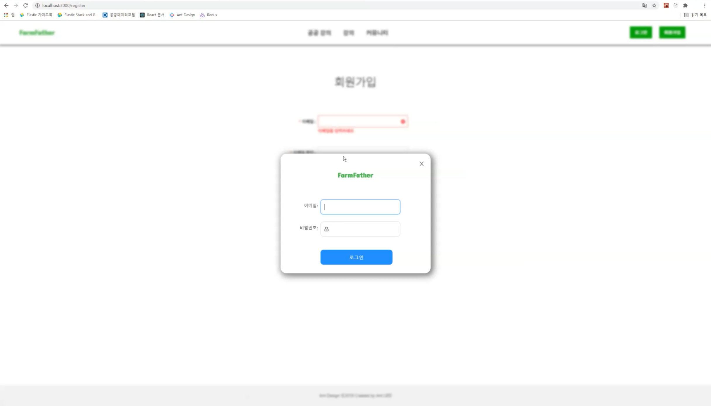

## 1. 프로젝트 소개

### 1) 주제

농축산업 관련 온라인 강의 플랫폼입니다. 첫 번째로 '농사로'에서 제공하는 온라인 강의 컨텐츠를 오픈 API를 통해 보여줍니다. 두 번째로 사설 강의를 개설하고 판매할 수 있는 기능을 포함합니다. 또한 사용자간의 정보 공유를 위한 커뮤니티 기능을 가지고 있습니다.

### 2) API

BackEnd API는 스프링부트를 사용하여 구성했으며 추후 게시판 전문 검색을 고려하여 데이터 저장소는 ElasticSearch를 사용했습니다. => [API 프로젝트 repository](https://github.com/yaincoding/farmfather-api)

 

## 2. 화면 구성

### 1) 회원가입

### 2) 로그인

### 3) 농사로 강의 리스트 

### 4) 수업 정보

### 5) 수업 강의 컨텐츠

### 6) Q&A

### 7) 리뷰

### 8) 수업 생성

### 9) 수업 정보 수정

### 10) 수업 컨텐츠 수정

### 11) 수업 썸네일 수정

### 12) 강의 관리

### 13) 내 정보

### 14) 게시판 글 목록

### 15) 게시판 글 작성 및 수정

